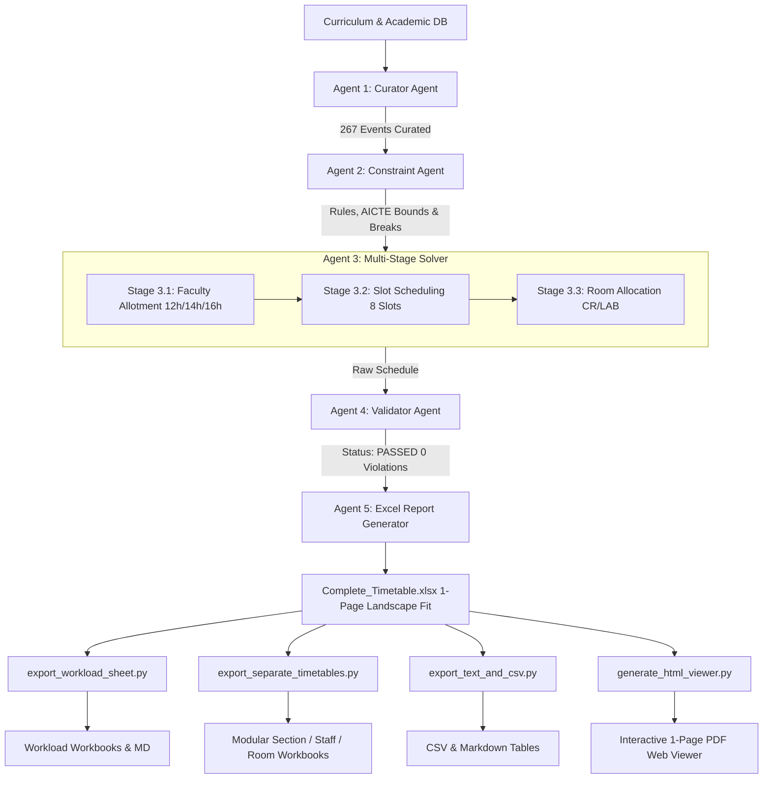

# 🎓 Agentic AI College Timetable Generator & Multi-View Scheduling Suite

[](https://www.python.org/)
[](https://developers.google.com/optimization)
[](https://openpyxl.readthedocs.io/)
[]()
[](https://gitlab.com)
[](https://github.com)

An enterprise-grade, agentic discrete optimization framework that solves the university course timetabling problem (**NP-hard**) across multiple engineering departments, semesters, student sections, faculty hierarchies, and physical infrastructure.

Powered by **Google OR-Tools CP-SAT (Constraint Programming - Satisfiability)**, the system achieves conflict-free academic schedules in seconds, strictly enforces pedagogical, ergonomics, AICTE faculty workload norms, and laboratory limits, and delivers a complete reporting ecosystem: styled Excel master workbooks, departmental master sheets, individual section and teacher timetables, room utilization registries, CSV/Markdown database exports, and a zero-dependency **Interactive 1-Page PDF Print-Ready Web Viewer**.

---

## 📑 Table of Contents

- [1. Executive Summary](#1-executive-summary)
- [2. Institutional Specifications & Environment](#2-institutional-specifications--environment)
- [3. Complete Constraint Matrix ("Conditions to All Components")](#3-complete-constraint-matrix-conditions-to-all-components)
  - [3.1 Hard Constraints (Zero-Tolerance)](#31-hard-constraints-zero-tolerance)
  - [3.2 Pedagogical, Workload & Shift Optimization](#32-pedagogical-workload--shift-optimization)
- [4. Multi-Agent Architecture](#4-multi-agent-architecture)
  - [Agent 1: Curator Agent (`CuratorAgent`)](#agent-1-curator-agent-curatoragent)
  - [Agent 2: Constraint Agent (`ConstraintAgent`)](#agent-2-constraint-agent-constraintagent)
  - [Agent 3: Solver Agent (`SolverAgent`)](#agent-3-solver-agent-solveragent)
  - [Agent 4: Validator Agent (`ValidatorAgent`)](#agent-4-validator-agent-validatoragent)
  - [Agent 5: Excel Report Generator (`ExcelGenerator`)](#agent-5-excel-report-generator-excelgenerator)
- [5. Auxiliary Export & Distribution Suite](#5-auxiliary-export--distribution-suite)
- [6. User Interfaces: Web Dashboard & Desktop GUI](#6-user-interfaces-web-dashboard--desktop-gui)
  - [6.1 Interactive Web Dashboard (`Timetable_Viewer.html`)](#61-interactive-web-dashboard-timetable_viewerhtml)
  - [6.2 Desktop Control Dashboard GUI (`gui_app.py`)](#62-desktop-control-dashboard-gui-gui_apppy)
- [7. Complete Directory & Artifact Map](#7-complete-directory--artifact-map)
- [8. Installation & Setup Guide](#8-installation--setup-guide)
- [9. How to Run (Step-by-Step)](#9-how-to-run-step-by-step)
- [10. GitHub & GitLab Setup, Push & CI/CD Deployment](#10-github--gitlab-setup-push--cicd-deployment)
- [11. Troubleshooting & Frequently Asked Questions (FAQ)](#11-troubleshooting--frequently-asked-questions-faq)
- [12. License & Author Info](#12-license--author-info)

---

## 1. Executive Summary

Higher education scheduling involves thousands of interdependent variables. Manual scheduling leads to teacher overlaps, room double-bookings, unfair workload distribution, and student burnout.

This project replaces manual timetabling with an **Agentic AI Pipeline**:
1. **Multi-Stage Optimization**: Decouples teacher assignment from time-slot scheduling and room allocation, dramatically collapsing the search space and eliminating permutation symmetry.
2. **Deterministic Feasibility**: Delivers provably optimal, collision-free timetables in under 5 seconds.
3. **Calibrated Workloads & Lab Limits**: Directly adheres to institutional requirements—exact faculty workload norms by designation (Prof: 12h, Assoc: 14h, Asst: 16h) and strictly **1 laboratory session per section per week**.
4. **1-Page PDF & Print Architecture**: All generated Excel sheets and the interactive web viewer are pre-configured with landscape single-page print scaling (`fitToWidth = 1`, `fitToHeight = 1`), allowing flawless PDF downloads and printing without multi-page split errors.

---

## 2. Institutional Specifications & Environment

The scheduling engine is calibrated for engineering institutions with multi-shift operations, shared electives, and physical lab constraints:

| Entity | Parameter | Description / Allocation |
| :--- | :--- | :--- |
| **Operational Days** | 6 Days | Monday, Tuesday, Wednesday, Thursday, Friday, Saturday |
| **Daily Periods** | 8 Teaching Slots | **Morning**: `08:30-09:30` (60m), `09:30-10:30` (60m)<br>**Mid Session**: `11:00-11:50` (50m), `11:50-12:40` (50m), `12:40-13:30` (50m)<br>**Noon Session**: `14:30-15:30` (60m), `15:30-16:30` (60m), `16:30-17:30` (60m) |
| **Short Break** | 30 Mins Fixed | `10:30-11:00` (Morning tea/snack break between Slot 1 and Slot 2) |
| **Lunch Break** | 1 Hour Fixed | `13:30-14:30` (1:30 to 2:30 PM institutional lunch pause between Slot 4 and Slot 5) |
| **Day Concludes** | 5:30 PM | Academic day concludes promptly at `17:30` |
| **Departments** | 2 Branches | **ISE** (Information Science & Engg.) & **CSBS** (Computer Science & Business Systems) |
| **Student Sections** | 13 Sections | **ISE (7)**: `ISE_S3_A`, `ISE_S3_B`, `ISE_S3_C`, `ISE_S5_A`, `ISE_S5_B`, `ISE_S7_A`, `ISE_S7_B`<br>**CSBS (6)**: `CSBS_S1_A`, `CSBS_S1_B`, `CSBS_S3_A`, `CSBS_S3_B`, `CSBS_S5_A`, `CSBS_S7_A` |
| **Classrooms** | 7 Rooms | `CR_1`, `CR_2`, `CR_3`, `CR_4`, `CR_5`, `CR_6`, `CR_7` |
| **Laboratories** | 2 Labs | `LAB_1`, `LAB_2` (Equipped for specialized practical computing sessions) |
| **Faculty Pool** | 20 Teachers | **4 Professors**: `Professor 1` to `Professor 4` (Target: **12 Hours**)<br>**6 Associate Professors**: `Associate Professor 1` to `Associate Professor 6` (Target: **14 Hours**)<br>**10 Assistant Professors**: `Assistant Professor 1` to `Assistant Professor 10` (Target: **16 Hours**) |
| **Lab Constraint** | Strictly 1 Lab/Week | Every student section has **strictly only 1 laboratory session in a week** (no more than 1) |
| **Total Academic Events**| 267 Events (293 Hrs) | **234** Theory sessions (18h/section), **13** 3-hour Laboratory sessions (1/section), **12** Open Elective (OE) sessions, **8** Physical Education (PE) sessions |

---

## 3. Complete Constraint Matrix ("Conditions to All Components")

All scheduling components are strictly governed by formal mathematical constraints enforced during CP-SAT solving and validated post-generation:

### 3.1 Hard Constraints (Zero-Tolerance)

Every generated timetable **MUST** satisfy 100% of these hard constraints with zero violations:

1. **Room Collision Avoidance**:
   - No classroom (`CR_1`–`CR_7`) or lab (`LAB_1`–`LAB_2`) can host more than one session at any given time slot:
     $$\forall r \in \text{ROOMS}, \forall t \in \text{SLOTS}: \sum_{e \text{ active at } t \text{ in } r} 1 \le 1$$
2. **Faculty Collision Avoidance**:
   - A teacher cannot teach two different sections or courses in the same time slot:
     $$\forall f \in \text{STAFF}, \forall t \in \text{SLOTS}: \sum_{e \text{ active at } t \text{ with } f} 1 \le 1$$
3. **Student Cohort Collision Avoidance**:
   - A student section cannot attend two simultaneous lectures or labs.
4. **Strict 1-Lab-Per-Week Limit**:
   - Each section has strictly **only 1 laboratory block per week**.
   - Exactly 13 laboratory sessions across the entire institution.
5. **Consecutive 3-Hour Laboratory Blocks (Break & Lunch Invariance)**:
   - Labs run continuously for 3 consecutive periods (duration = 3).
   - Valid laboratory start slots are strictly restricted to:
     - **Slot 2** (`11:00–13:30`: Mid session block spanning `11:00–11:50`, `11:50–12:40`, `12:40–13:30`), OR
     - **Slot 5** (`14:30–17:30`: Noon session block spanning `14:30–15:30`, `15:30–16:30`, `16:30–17:30`).
   - Labs **never cross or interrupt the short break (`10:30–11:00`) or lunch hour (`13:30–14:30`)**.
6. **Open Elective (OE) Synchronization**:
   - Open Electives for Semesters 5 & 7 across ISE & CSBS are strictly synchronized at **Slot 1 (`09:30–10:30`)** before the short break to allow inter-departmental elective enrollment without timetable clashes.
7. **Physical Education (PE) Combined Sessions**:
   - PE sessions are scheduled synchronously at **Slot 5 (`14:30–15:30`)** immediately after lunch with combined cohort attendance (`ISE_S5_A` + `CSBS_S5_A`, etc.).
8. **Senior Faculty Morning Exemption**:
   - Professors and Associate Professors **cannot** be scheduled for the earliest morning slot (Slot 0: `08:30–09:30`). Only Assistant Professors may take Slot 0.
9. **Compact Student Daily Shift Restriction**:
   - To prevent scattered student schedules with idle gaps, each section on each day is restricted to either:
     - **Early Shift**: Confined between Slot 0 and Slot 5 (`08:30–15:30`), OR
     - **Late Shift**: Confined between Slot 2 and Slot 7 (`11:00–17:30`).
10. **Teacher-Course Uniformity (Affinity Rule)**:
    - Every lecture and lab of a specific course for a given section is taught by the **exact same** allotted faculty member throughout the entire week.

### 3.2 Pedagogical, Workload & Shift Optimization

1. **AICTE Workload Norms Calibration**:
   - **Professors**: Target **12 Hours / Week** (bounded 10–14h, exact 12h prioritized).
   - **Associate Professors**: Target **14 Hours / Week** (bounded 12–16h, 14h prioritized).
   - **Assistant Professors**: Target **16 Hours / Week** (bounded 14–18h, 16h prioritized).
   - The CP-SAT solver minimizes total deviation $\sum |load_t - target_t|$ across all 20 faculty members.
2. **Subject Diversity Cap**:
   - No faculty member may teach more than **3 distinct subjects** across all semesters.
3. **Section Exposure Cap**:
   - No faculty member may be assigned to more than **3 distinct student sections**.
4. **1-Page Print / PDF Layout Architecture**:
   - Excel workbooks configured with `fitToWidth = 1`, `fitToHeight = 1`, `orientation = landscape`.
   - Web Viewer configured with `@media print { @page { size: A4 landscape; margin: 5mm 6mm; } }` ensuring any section timetable prints or exports to PDF on **exactly 1 single page**.

---

## 4. Multi-Agent Architecture

The generation engine operates as a sequential, multi-agent cooperative architecture:



### Agent 1: Curator Agent (`CuratorAgent`)
- Reads section definitions, staff registries, and department curricula.
- Builds 267 academic events: 234 Theory events (18 hrs/section/week across 6 subjects), 13 Laboratory 3-hour blocks (strictly 1 lab per section), 12 Open Elective sessions, and 8 Physical Education sessions.
- Groups events by `(sections, subject, type)` into 101 coherent courses to guarantee teacher continuity.

### Agent 2: Constraint Agent (`ConstraintAgent`)
- Audits and registers all operational rules, 8-period daily topology, break intervals (`10:30-11:00` and `13:30-14:30`), AICTE workload bounds, and resource capacities.

### Agent 3: Solver Agent (`SolverAgent`)
Implements a 3-stage optimization pipeline using Google OR-Tools CP-SAT:
- **Stage 3.1 (Faculty Allotment)**: Solves an integer programming model to assign 20 teachers to 101 courses subject to AICTE workload targets (Prof: 12h, Assoc: 14h, Asst: 16h), maximum 3 subjects/teacher, and maximum 3 sections/teacher.
- **Stage 3.2 (Time-Slot Scheduling)**: Creates `IntervalVar` intervals for each event over $6 \times 8 = 48$ time slots. Uses `AddNoOverlap` for teachers and student sections, enforces shift compactness via boolean reification, pins OE to slot 1, pins PE to slot 5, restricts lab starts to valid blocks (slot 2 or 5), and uses `AddCumulative` for 7 classrooms and 2 labs.
- **Stage 3.3 (Room Allocation)**: Assigns physical rooms (`CR_1`–`CR_7` and `LAB_1`–`LAB_2`) via an interval-coloring conflict-free allocation.

### Agent 4: Validator Agent (`ValidatorAgent`)
- Executes an exhaustive post-generation audit:
  - Checks for teacher collisions, room collisions, and section collisions.
  - Verifies lab durations (3h), valid lab starts (slot 2 or 5), and non-crossing of breaks.
  - Verifies OE slot == 1 (09:30-10:30) and PE slot == 5 (14:30-15:30).
  - Verifies no senior staff at slot 0 (08:30).
  - Asserts teacher subjects $\le 3$ and sections $\le 3$.
  - Confirms total event counts: 234 Theory, 13 Lab (1 lab/section), 12 OE, 8 PE (Total = 267).

### Agent 5: Excel Report Generator (`ExcelGenerator`)
- Assembles `Complete_Timetable.xlsx` configured with landscape 1-page print settings:
  - 13 Section Timetable sheets (`ISE_S3_A` to `CSBS_S7_A`) with Short Break (`10:30-11:00`) and Lunch Break (`13:30-14:30`) banners.
  - 2 Department Master sheets (`ISE_MASTER`, `CSBS_MASTER`).
  - Consolidated `STAFF_TIMETABLE` and `ROOM_UTILIZATION` sheets.
  - Full `VALIDATION_REPORT` sheet and `AGENT_EXECUTION` audit log.

---

## 5. Auxiliary Export & Distribution Suite

| Script | Output File(s) | Purpose |
| :--- | :--- | :--- |
| `export_workload_sheet.py` | `Teacher_Workload_Sheet.xlsx`<br>`Timetable_CSVs/TEACHER_WORKLOAD.csv`<br>`Timetable_Text_Views/TEACHER_WORKLOAD.md` | Generates comprehensive faculty workload analytics with target vs assigned comparisons (Prof: 12h, Assoc: 14h, Asst: 16h), daily loads, subjects, sections, and 1-page print setup. |
| `export_separate_timetables.py` | `Timetable_Exports/Sections/*.xlsx`<br>`Timetable_Exports/Staff/*.xlsx`<br>`Timetable_Exports/Rooms/*.xlsx`<br>`Timetable_Exports/Departments/*.xlsx` | Splits the master file into 44 standalone, formatted Excel files (13 sections, 20 staff, 9 rooms, 2 departments), all pre-configured for 1-page landscape printing. |
| `export_text_and_csv.py` | `Timetable_CSVs/*.csv`<br>`Timetable_Text_Views/*.md`<br>`ALL_TIMETABLES.md` | Generates lightweight CSV files for database import, Markdown tables for git diffs, and a unified markdown report (`ALL_TIMETABLES.md`). |
| `generate_html_viewer.py` | `Timetable_Viewer.html` | Generates a self-contained, responsive, dark-mode single-page web app with `@media print` 1-page A4 landscape layout and one-click PDF export. |
| `gui_app.py` | Native Desktop GUI | Interactive control center dashboard with one-click pipeline execution, real-time solver logs, and quick-launch buttons. |
| `run_all.py` | All of the above | Master orchestration script that executes the complete pipeline end-to-end in ~5 seconds. |

---

## 6. User Interfaces: Web Dashboard & Desktop GUI

### 6.1 Interactive Web Dashboard (`Timetable_Viewer.html`)
Open with one click using `Open_Web_Viewer.bat` or by opening `Timetable_Viewer.html` directly in any web browser:
- **5 Perspectives**: Section Timetables (13 cohorts), Faculty Workload Sheet, Individual Faculty Schedules (20 teachers), Room Utilization (7 CRs + 2 Labs), and Department Masters.
- **AICTE Workload Analytics**: Displays target workload cards (Prof: 12h, Assoc: 14h, Asst: 16h), compliance badges, and day-wise distributions.
- **One-Click 1-Page PDF Export**: Click **"🖨️ Print / Save 1-Page PDF"** to print or save the active section timetable fitting entirely on a single landscape A4 page.
- **One-Click CSV Export**: Instant client-side download of active schedules.

### 6.2 Desktop Control Dashboard GUI (`gui_app.py` / `Launch_GUI.bat`)
Launch by double-clicking `Launch_GUI.bat` or running `python gui_app.py`:
- **One-Click Execution**: Press **"▶ Run Complete Pipeline"** to solve constraints and regenerate schedules on-demand.
- **Live Output Console**: Watch Google OR-Tools CP-SAT solve constraints in real time with animated progress indicators.
- **Instant Launchers**: Dedicated buttons to open the Web UI, Master Excel, Workload Workbook, and Exports Directory.

---

## 7. Complete Directory & Artifact Map

```
Timetable/
│
├── .gitignore                      # Git ignore file (cache, venv, temporary Excel lock files)
├── .gitlab-ci.yml                  # Automated GitLab CI/CD pipeline configuration
├── requirements.txt                # Python project dependencies
├── README.md                       # Comprehensive institutional documentation
├── run_all.py                      # Master pipeline orchestration runner
│
├── gui_app.py                      # Modern Desktop GUI Control Dashboard (Tkinter)
├── Launch_GUI.bat                  # Double-click launcher for Desktop GUI Control Center
├── Open_Web_Viewer.bat             # Double-click launcher for Interactive Web Viewer
│
├── main.py                         # Core multi-agent CP-SAT timetable generator
├── timetable_generator.py          # Standalone mirror of the core generator
│
├── export_workload_sheet.py        # Calculates faculty workload metrics and exports workload sheets
├── export_separate_timetables.py   # Exports modular Excel files for sections, staff, rooms, and depts
├── export_text_and_csv.py          # Converts timetables into CSVs and Markdown tables
├── generate_html_viewer.py         # Generates the self-contained HTML interactive dashboard
│
├── Complete_Timetable.xlsx         # Primary Master Workbook (1-Page Landscape print ready)
├── Teacher_Workload_Sheet.xlsx     # Standalone Faculty Workload Distribution Workbook
├── Timetable_Viewer.html           # Interactive zero-dependency Web Application Dashboard
├── ALL_TIMETABLES.md               # Unified Markdown document containing all section tables
│
├── Timetable_CSVs/                 # Clean CSV exports for database import
│   ├── CSBS_MASTER.csv
│   ├── CSBS_S1_A.csv ... CSBS_S7_A.csv
│   ├── ISE_MASTER.csv
│   ├── ISE_S3_A.csv ... ISE_S7_B.csv
│   ├── ROOM_UTILIZATION.csv
│   ├── STAFF_TIMETABLE.csv
│   └── TEACHER_WORKLOAD.csv
│
├── Timetable_Exports/              # Decomposed standalone Excel workbooks (1-page fit)
│   ├── Departments/                # ISE_MASTER.xlsx, CSBS_MASTER.xlsx
│   ├── Rooms/                      # CR_1.xlsx to CR_7.xlsx, LAB_1.xlsx, LAB_2.xlsx
│   ├── Sections/                   # CSBS_S1_A.xlsx to ISE_S7_B.xlsx (13 workbooks)
│   ├── Staff/                      # Assistant_Professor_*.xlsx to Professor_*.xlsx (20 workbooks)
│   └── Teacher_Workload_Sheet.xlsx
│
└── Timetable_Text_Views/           # Formatted Markdown tables for each section and workload
    ├── CSBS_MASTER.md
    ├── CSBS_S1_A.md ... CSBS_S7_A.md
    ├── ISE_MASTER.md
    ├── ISE_S3_A.md ... ISE_S7_B.md
    └── TEACHER_WORKLOAD.md
```

---

## 8. Installation & Setup Guide

### 8.1 Prerequisites
- **Python**: Version `3.9` or higher (`Python 3.10`, `3.11`, `3.12`, or `3.14` supported).
- **Operating System**: Windows, macOS, or Linux.
- **Memory**: Minimum 4 GB RAM (solver uses ~150 MB).

### 8.2 Installation Steps

1. **Clone or Download the Repository**:
   ```bash
   git clone <YOUR_REPOSITORY_URL>
   cd Timetable
   ```

2. **Create and Activate a Virtual Environment (Recommended)**:
   - On Windows (PowerShell):
     ```powershell
     python -m venv .venv
     .venv\Scripts\Activate.ps1
     ```
   - On Linux / macOS:
     ```bash
     python3 -m venv .venv
     source .venv/bin/activate
     ```

3. **Install Dependencies**:
   ```bash
   pip install --upgrade pip
   pip install -r requirements.txt
   ```

---

## 9. How to Run (Step-by-Step)

### Option A: One-Command Execution (Recommended)
Run the entire generation, audit, analytics, and export pipeline with a single command:

```bash
python run_all.py
```

### Option B: Running Individual Modules Manually

1. **Run the Solver & Generate Master Timetable**:
   ```bash
   python main.py
   ```
2. **Calculate Workloads & Add Workload Sheet**:
   ```bash
   python export_workload_sheet.py
   ```
3. **Decompose Master into Individual Workbooks**:
   ```bash
   python export_separate_timetables.py
   ```
4. **Export CSVs and Markdown Tables**:
   ```bash
   python export_text_and_csv.py
   ```
5. **Rebuild Interactive Web Dashboard**:
   ```bash
   python generate_html_viewer.py
   ```

---

## 10. GitHub & GitLab Setup, Push & CI/CD Deployment

### 10.1 Pushing to GitHub

1. **Initialize Git**:
   ```bash
   git init
   ```
2. **Stage all files**:
   ```bash
   git add .
   ```
3. **Commit changes**:
   ```bash
   git commit -m "feat: complete timetable generation suite with AICTE workload calibration & 1-page PDF fit"
   ```
4. **Link to your GitHub Repository**:
   ```bash
   git remote add origin https://github.com/amithbhoomkar/college-timetable-generator.git
   git branch -M main
   git push -u origin main
   ```

### 10.2 Pushing to GitLab

1. **Link to your GitLab Repository**:
   ```bash
   git remote add origin https://gitlab.com/<your-username>/<your-repo-name>.git
   git branch -M main
   git push -u origin main
   ```

2. **Automated GitLab CI/CD Pipeline**:
   The included `.gitlab-ci.yml` pipeline automatically builds, validates all constraints, archives Excel/CSV artifacts, and publishes `Timetable_Viewer.html` to **GitLab Pages**.

---

## 11. Troubleshooting & Frequently Asked Questions (FAQ)

### Q1: `PermissionError: [Errno 13] Permission denied: 'Complete_Timetable.xlsx'`
- **Cause**: The file is open in Microsoft Excel, locking write permissions.
- **Fix**: Close Microsoft Excel and re-run `python run_all.py`.

### Q2: How does the 1-Page PDF Fit work?
- In Microsoft Excel, each worksheet has `Fit to 1 page wide by 1 page tall` enabled in Landscape mode.
- In `Timetable_Viewer.html`, click **"🖨️ Print / Save 1-Page PDF"**; the browser print dialog will render the entire timetable on a single landscape A4 sheet.

### Q3: How do I change faculty workload targets or student sections?
- In `main.py`, edit the `STAFF` registry (lines 125–150) or `SECTIONS` registry (lines 99–120). The Google OR-Tools CP-SAT optimizer will automatically recalibrate optimal assignments when you run `python run_all.py`.

---

## 12. License & Author Info

- **Engine Architecture**: Multi-Agent Discrete Optimization Pipeline.
- **Solver Engine**: Google OR-Tools CP-SAT.
- **Developed for**: Academic Timetable Coordination & Faculty Workload Management (ISE & CSBS Departments).
- **License**: MIT License — open for institutional adaptation, customization, and deployment.
