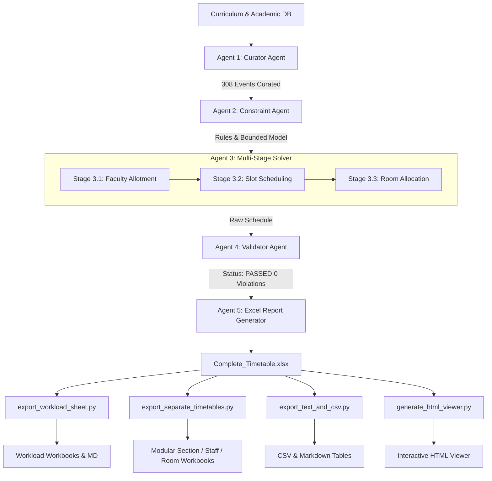

# 🎓 Agentic AI College Timetable Generator & Multi-View Scheduling Suite

[](https://www.python.org/)
[](https://developers.google.com/optimization)
[](https://openpyxl.readthedocs.io/)
[]()
[](https://gitlab.com)

An enterprise-grade, agentic discrete optimization framework that solves the university course timetabling problem (**NP-hard**) across multiple engineering departments, semesters, student sections, faculty hierarchies, and physical infrastructure.

Powered by **Google OR-Tools CP-SAT (Constraint Programming - Satisfiability)**, the system achieves conflict-free academic schedules in seconds, enforces pedagogical and ergonomic guidelines (daily shift compactness, workload balancing, senior faculty morning exemptions), and delivers a complete reporting ecosystem: styled Excel master workbooks, departmental master sheets, individual section and teacher timetables, room utilization registries, CSV/Markdown database exports, and a modern zero-dependency **Interactive Dark-Mode Web Viewer**.

---

## 📑 Table of Contents

- [1. Executive Summary](#1-executive-summary)
- [2. Institutional Specifications & Environment](#2-institutional-specifications--environment)
- [3. Complete Constraint Matrix ("Conditions to All Components")](#3-complete-constraint-matrix-conditions-to-all-components)
  - [3.1 Hard Constraints (Zero-Tolerance)](#31-hard-constraints-zero-tolerance)
  - [3.2 Soft & Optimization Constraints](#32-soft--optimization-constraints)
- [4. Multi-Agent Architecture](#4-multi-agent-architecture)
  - [Agent 1: Curator Agent (`CuratorAgent`)](#agent-1-curator-agent-curatoragent)
  - [Agent 2: Constraint Agent (`ConstraintAgent`)](#agent-2-constraint-agent-constraintagent)
  - [Agent 3: Solver Agent (`SolverAgent`)](#agent-3-solver-agent-solveragent)
  - [Agent 4: Validator Agent (`ValidatorAgent`)](#agent-4-validator-agent-validatoragent)
  - [Agent 5: Excel Report Generator (`ExcelGenerator`)](#agent-5-excel-report-generator-excelgenerator)
- [5. Auxiliary Export & Distribution Suite](#5-auxiliary-export--distribution-suite)
- [6. Interactive Web Dashboard (`Timetable_Viewer.html`)](#6-interactive-web-dashboard-timetable_viewerhtml)
- [7. Complete Directory & Artifact Map](#7-complete-directory--artifact-map)
- [8. Installation & Setup Guide](#8-installation--setup-guide)
- [9. How to Run (Step-by-Step)](#9-how-to-run-step-by-step)
- [10. GitLab Setup, Push & CI/CD Deployment](#10-gitlab-setup-push--cicd-deployment)
- [11. Troubleshooting & Frequently Asked Questions (FAQ)](#11-troubleshooting--frequently-asked-questions-faq)
- [12. License & Author Info](#12-license--author-info)

---

## 1. Executive Summary

Higher education scheduling involves thousands of interdependent variables. Manual scheduling leads to teacher overlaps, room double-bookings, unfair workload distribution, and student burnout.

This project replaces manual timetabling with an **Agentic AI Pipeline**:
1. **Multi-Stage Optimization**: Decouples teacher assignment from time-slot scheduling and room allocation, dramatically collapsing the search space and eliminating permutation symmetry.
2. **Deterministic Feasibility**: Delivers provably optimal, collision-free timetables in under 15 seconds.
3. **Comprehensive Export Ecosystem**: Generates unified master sheets, standalone department files, personalized teacher schedules, room occupancy matrices, CSV feeds, and a zero-server interactive web UI.

---

## 2. Institutional Specifications & Environment

The scheduling engine is calibrated for engineering institutions with multi-shift operations, shared electives, and physical lab constraints:

| Entity | Parameter | Description / Allocation |
| :--- | :--- | :--- |
| **Operational Days** | 6 Days | Monday, Tuesday, Wednesday, Thursday, Friday, Saturday |
| **Daily Periods** | 9 Teaching Slots | `07:30-08:30`, `08:30-09:30`, `09:30-10:30`, `10:30-11:30`, `11:30-12:30`, `12:30-13:30`, `14:30-15:30`, `15:30-16:30`, `16:30-17:30` |
| **Lunch Break** | 1 Hour Fixed | `13:30-14:30` (Strict institutional pause; no classes or labs allowed) |
| **Departments** | 2 Branches | **ISE** (Information Science & Engg.) & **CSBS** (Computer Science & Business Systems) |
| **Student Sections** | 13 Sections | **ISE (7)**: `ISE_S3_A`, `ISE_S3_B`, `ISE_S3_C`, `ISE_S5_A`, `ISE_S5_B`, `ISE_S7_A`, `ISE_S7_B`<br>**CSBS (6)**: `CSBS_S1_A`, `CSBS_S1_B`, `CSBS_S3_A`, `CSBS_S3_B`, `CSBS_S5_A`, `CSBS_S7_A` |
| **Classrooms** | 7 Rooms | `CR_1`, `CR_2`, `CR_3`, `CR_4`, `CR_5`, `CR_6`, `CR_7` |
| **Laboratories** | 2 Labs | `LAB_1`, `LAB_2` (Equipped for specialized practical computing sessions) |
| **Faculty Pool** | 20 Teachers | **4 Professors**: `Professor 1` to `Professor 4`<br>**6 Associate Professors**: `Associate Professor 1` to `Associate Professor 6`<br>**10 Assistant Professors**: `Assistant Professor 1` to `Assistant Professor 10` |
| **Total Academic Events**| 308 Events | **275** Theory sessions, **13** 3-hour Laboratory sessions, **12** Open Elective (OE) sessions, **8** Physical Education (PE) sessions |

---

## 3. Complete Constraint Matrix ("Conditions to All Components")

All scheduling components are strictly governed by formal mathematical constraints enforced during CP-SAT solving and validated post-generation:

### 3.1 Hard Constraints (Zero-Tolerance)

Every generated timetable **MUST** satisfy 100% of these hard constraints:

1. **Room Collision Avoidance**:
   - No classroom (`CR_1`–`CR_7`) or lab (`LAB_1`–`LAB_2`) can host more than one session at any given time slot:
     $$\forall r \in \text{ROOMS}, \forall t \in \text{SLOTS}: \sum_{e \text{ active at } t \text{ in } r} 1 \le 1$$
2. **Faculty Collision Avoidance**:
   - A teacher cannot teach two different sections or courses in the same time slot:
     $$\forall f \in \text{STAFF}, \forall t \in \text{SLOTS}: \sum_{e \text{ active at } t \text{ with } f} 1 \le 1$$
3. **Student Cohort Collision Avoidance**:
   - A student section cannot attend two simultaneous lectures or labs.
4. **Consecutive 3-Hour Laboratory Blocks**:
   - Labs must run continuously for exactly 3 periods (duration = 3).
   - Valid laboratory start slots are strictly restricted to **Slot 0** (`07:30`), **Slot 3** (`10:30`), or **Slot 6** (`14:30`).
   - Labs **never cross or interrupt the lunch hour** (`13:30–14:30`).
5. **Lunch Break Invariance**:
   - Slot `13:30–14:30` is completely excluded from academic scheduling across all departments.
6. **Open Elective (OE) Synchronization**:
   - Open Electives for Semesters 5 & 7 across ISE & CSBS are strictly synchronized at **Slot 2 (`09:30–10:30`)** to allow students to attend inter-departmental electives without conflict.
7. **Physical Education (PE) Combined Sessions**:
   - PE sessions are scheduled synchronously at **Slot 6 (`14:30–15:30`)** with combined cohort attendance (`ISE_S5_A` + `CSBS_S5_A`, etc.).
8. **Senior Faculty Morning Exemption**:
   - Professors and Associate Professors **cannot** be scheduled for the earliest morning slot (Slot 0: `07:30–08:30`). Only Assistant Professors may take Slot 0.
9. **Compact Student Daily Shift Restriction**:
   - To prevent scattered student schedules with idle gaps, each section on each day is restricted to either:
     - **Early Shift**: Confined between Slot 0 and Slot 5 (`07:30–13:30`), OR
     - **Late Shift**: Confined between Slot 3 and Slot 8 (`10:30–17:30`).
10. **Teacher-Course Uniformity (Affinity Rule)**:
    - Every lecture and lab of a specific course for a given section is taught by the **exact same** allotted faculty member throughout the week.

### 3.2 Soft & Optimization Constraints

The solver balances teacher workloads and maintains teaching diversity:

1. **Balanced Faculty Workload**:
   - Weekly teaching hours per faculty member are bounded between **12 hours (minimum)** and **22 hours (maximum)**.
2. **Subject Diversity Cap**:
   - No faculty member may teach more than **3 distinct subjects** across all semesters.
3. **Section Exposure Cap**:
   - No faculty member may be assigned to more than **3 distinct student sections**.
4. **Classroom Permutation Symmetry Breaking**:
   - Modeled via CP-SAT cumulative capacity constraints rather than individual room variables during scheduling, collapsing search times from minutes to seconds.

---

## 4. Multi-Agent Architecture

The generation engine is designed as a sequential, multi-agent cooperative architecture:



### Agent 1: Curator Agent (`CuratorAgent`)
- Reads section definitions, staff registries, and department curricula.
- Builds 308 academic events: 275 Theory events (21–22 hrs/section/week), 13 Laboratory 3-hour blocks, 12 Open Elective sessions, and 8 Physical Education sessions.
- Groups events by `(sections, subject, type)` into 101 coherent courses to guarantee teacher continuity.

### Agent 2: Constraint Agent (`ConstraintAgent`)
- Audits and registers all operational rules, time boundaries, shift limits, and resource capacities.
- Prepares the state dictionary passed to the solver.

### Agent 3: Solver Agent (`SolverAgent`)
Implements a 3-stage optimization pipeline using Google OR-Tools CP-SAT:
- **Stage 3.1 (Faculty Allotment)**: Solves an integer programming model to assign 20 teachers to 101 courses subject to workload bounds (12–22 hrs/week), maximum 3 subjects/teacher, and maximum 3 sections/teacher.
- **Stage 3.2 (Time-Slot Scheduling)**: Creates `IntervalVar` intervals for each event over $6 \times 9 = 54$ time slots. Uses `AddNoOverlap` for teachers and student sections, enforces shift constraints via boolean reification, pins OE to slot 2, pins PE to slot 6, restricts lab starts to slots 0/3/6, and uses `AddCumulative` for 7 classrooms and 2 labs.
- **Stage 3.3 (Room Allocation)**: Assigns physical rooms (`CR_1`–`CR_7` and `LAB_1`–`LAB_2`) via an interval-coloring conflict-free allocation.

### Agent 4: Validator Agent (`ValidatorAgent`)
- Executes a comprehensive post-generation audit:
  - Checks for teacher collisions, room collisions, and section collisions.
  - Verifies lab durations, valid lab rooms, and non-lunch crossing.
  - Verifies OE slot == 2 and PE slot == 6.
  - Verifies no senior staff at slot 0 (07:30).
  - Asserts teacher subjects $\le 3$ and sections $\le 3$.
  - Confirms total event counts: 275 Theory, 13 Lab, 12 OE, 8 PE (Total = 308).

### Agent 5: Excel Report Generator (`ExcelGenerator`)
- Assembles `Complete_Timetable.xlsx` with professional formatting:
  - 13 Section Timetable sheets (`ISE_S3_A` to `CSBS_S7_A`) with 24-character cell widths, lunch banners, subject/teacher/room text blocks.
  - 2 Department Master sheets (`ISE_MASTER`, `CSBS_MASTER`).
  - Consolidated `STAFF_TIMETABLE` and `ROOM_UTILIZATION` sheets.
  - Full `VALIDATION_REPORT` sheet and `AGENT_EXECUTION` audit log.

---

## 5. Auxiliary Export & Distribution Suite

Beyond the master workbook, dedicated export modules convert schedules into production formats for academic administration:

| Script | Output File(s) | Purpose |
| :--- | :--- | :--- |
| `export_workload_sheet.py` | `Teacher_Workload_Sheet.xlsx`<br>`Timetable_CSVs/TEACHER_WORKLOAD.csv`<br>`Timetable_Text_Views/TEACHER_WORKLOAD.md` | Computes comprehensive faculty workload metrics (Theory, Lab sessions & hours, OE, PE, day-wise Monday–Saturday load, subjects handled, sections taught) and injects `TEACHER_WORKLOAD` into `Complete_Timetable.xlsx`. |
| `export_separate_timetables.py` | `Timetable_Exports/Sections/*.xlsx`<br>`Timetable_Exports/Staff/*.xlsx`<br>`Timetable_Exports/Rooms/*.xlsx`<br>`Timetable_Exports/Departments/*.xlsx` | Splits the master file into 44 standalone, formatted Excel files: 13 for each section, 20 for individual faculty members, 9 for room utilization, and 2 for department heads. |
| `export_text_and_csv.py` | `Timetable_CSVs/*.csv`<br>`Timetable_Text_Views/*.md`<br>`ALL_TIMETABLES.md` | Generates lightweight CSV files for database importing, Markdown tables for git diffs/documentation, and a unified markdown report (`ALL_TIMETABLES.md`). |
| `generate_html_viewer.py` | `Timetable_Viewer.html` | Generates a self-contained, responsive, dark-mode single-page web application embedding all schedule data in JSON format for instant offline viewing. |
| `gui_app.py` | Native Desktop GUI | Interactive control center dashboard with one-click pipeline execution, real-time solver logs, and quick-launch buttons for all workbooks and viewers. |
| `run_all.py` | All of the above | Master orchestration script that executes the complete pipeline end-to-end in ~18 seconds. |

---

## 6. User Interfaces: Web Dashboard & Desktop GUI

The system includes **two distinct user interfaces** designed for faculty, students, and administrative review:

### 6.1 Interactive Web Dashboard (`Timetable_Viewer.html`)
Open with one click using `Open_Web_Viewer.bat` or by opening `Timetable_Viewer.html` directly in any web browser:
- **5 Perspectives**: Section Timetables (13 cohorts), Faculty Workload Sheet, Individual Faculty Schedules (20 teachers), Room Utilization (7 CRs + 2 Labs), and Department Masters.
- **Dynamic Filters**: Real-time designation filtering (Professors, Associate Professors, Assistant Professors).
- **One-Click CSV Export**: Instant client-side download of active schedules.
- **Print / PDF Layout**: Automatically formats tables for official academic printouts.

### 6.2 Desktop Control Dashboard GUI (`gui_app.py` / `Launch_GUI.bat`)
Launch by double-clicking `Launch_GUI.bat` or running `python gui_app.py`:
- **One-Click Execution**: Press **"▶ Run Complete Pipeline"** to solve constraints and regenerate schedules on-demand.
- **Live Output Console**: Watch Google OR-Tools CP-SAT solve constraints in real time with animated progress indicators.
- **Instant Launchers**: Dedicated buttons to open the Web UI, Master Excel, Workload Workbook, and Exports Directory.

---

## 7. Complete Directory & Artifact Map

```
Timetable/
│
├── .gitignore                      # Git ignore file (cache, venv, temporary Excel lock files)
├── .gitlab-ci.yml                  # Automated GitLab CI/CD pipeline configuration
├── requirements.txt                # Python project dependencies
├── README.md                       # Comprehensive institutional documentation
├── run_all.py                      # Master pipeline orchestration runner
│
├── gui_app.py                      # Modern Desktop GUI Control Dashboard (Tkinter)
├── Launch_GUI.bat                  # Double-click launcher for Desktop GUI Control Center
├── Open_Web_Viewer.bat             # Double-click launcher for Interactive Web Viewer
│
├── main.py                         # Core multi-agent CP-SAT timetable generator
├── timetable_generator.py          # Standalone mirror of the core generator
│
├── export_workload_sheet.py        # Calculates faculty workload metrics and exports workload sheets
├── export_separate_timetables.py   # Exports modular Excel files for sections, staff, rooms, and depts
├── export_text_and_csv.py          # Converts timetables into CSVs and Markdown tables
├── generate_html_viewer.py         # Generates the self-contained HTML interactive dashboard
│
├── Complete_Timetable.xlsx         # Primary Master Workbook (All sections, masters, staff, rooms)
├── Teacher_Workload_Sheet.xlsx     # Standalone Faculty Workload Distribution Workbook
├── Timetable_Viewer.html           # Interactive zero-dependency Web Application Dashboard
├── ALL_TIMETABLES.md               # Unified Markdown document containing all section tables
│
├── Timetable_CSVs/                 # Clean CSV exports for database import
│   ├── CSBS_MASTER.csv
│   ├── CSBS_S1_A.csv ... CSBS_S7_A.csv
│   ├── ISE_MASTER.csv
│   ├── ISE_S3_A.csv ... ISE_S7_B.csv
│   ├── ROOM_UTILIZATION.csv
│   ├── STAFF_TIMETABLE.csv
│   └── TEACHER_WORKLOAD.csv
│
├── Timetable_Exports/              # Decomposed standalone Excel workbooks
│   ├── Departments/                # ISE_MASTER.xlsx, CSBS_MASTER.xlsx
│   ├── Rooms/                      # CR_1.xlsx to CR_7.xlsx, LAB_1.xlsx, LAB_2.xlsx
│   ├── Sections/                   # CSBS_S1_A.xlsx to ISE_S7_B.xlsx (13 workbooks)
│   ├── Staff/                      # Assistant_Professor_*.xlsx to Professor_*.xlsx (20 workbooks)
│   └── Teacher_Workload_Sheet.xlsx
│
└── Timetable_Text_Views/           # Formatted Markdown tables for each section and workload
    ├── CSBS_MASTER.md
    ├── CSBS_S1_A.md ... CSBS_S7_A.md
    ├── ISE_MASTER.md
    ├── ISE_S3_A.md ... ISE_S7_B.md
    └── TEACHER_WORKLOAD.md
```

---

## 8. Installation & Setup Guide

### 8.1 Prerequisites
- **Python**: Version `3.9` or higher (`Python 3.10`, `3.11`, `3.12`, or `3.14` supported).
- **Operating System**: Windows, macOS, or Linux.
- **Memory**: Minimum 4 GB RAM (solver uses ~150 MB).

### 8.2 Installation Steps

1. **Clone or Download the Repository**:
   ```bash
   git clone <YOUR_GITLAB_REPOSITORY_URL>
   cd Timetable
   ```

2. **Create and Activate a Virtual Environment (Recommended)**:
   - On Windows (PowerShell):
     ```powershell
     python -m venv .venv
     .venv\Scripts\Activate.ps1
     ```
   - On Linux / macOS:
     ```bash
     python3 -m venv .venv
     source .venv/bin/activate
     ```

3. **Install Dependencies**:
   ```bash
   pip install --upgrade pip
   pip install -r requirements.txt
   ```

   *Installed packages:*
   - `ortools` (Google Optimization Tools)
   - `openpyxl` (Excel manipulation & styling engine)

---

## 9. How to Run (Step-by-Step)

### Option A: One-Command Execution (Recommended)
Run the entire generation, audit, analytics, and export pipeline with a single command:

```bash
python run_all.py
```

**Expected output:**
```
================================================================================
   AUTOMATED TIMETABLE GENERATION & EXPORT PIPELINE
================================================================================

[1/5] Running Step 1: Constraint Solving & Master Timetable Generation (main.py)...
--------------------------------------------------------------------------------
--> [OK] Completed main.py in ~12s

[2/5] Running Step 2: Faculty Workload Analytics & Distribution Sheet (export_workload_sheet.py)...
--------------------------------------------------------------------------------
--> [OK] Completed export_workload_sheet.py in ~1.5s

[3/5] Running Step 3: Export Individual Excel Workbooks (export_separate_timetables.py)...
--------------------------------------------------------------------------------
--> [OK] Completed export_separate_timetables.py in ~2.7s

[4/5] Running Step 4: Export CSV Datasets and Markdown Tables (export_text_and_csv.py)...
--------------------------------------------------------------------------------
--> [OK] Completed export_text_and_csv.py in ~0.9s

[5/5] Running Step 5: Generate Interactive Web Dashboard (generate_html_viewer.py)...
--------------------------------------------------------------------------------
--> [OK] Completed generate_html_viewer.py in ~0.7s

================================================================================
   ALL PIPELINE STEPS COMPLETED SUCCESSFULLY IN ~18s
================================================================================
```

### Option B: Running Individual Modules Manually

If you only need to run a specific component:

1. **Run the Solver & Generate Master Timetable**:
   ```bash
   python main.py
   ```
   *Generates `Complete_Timetable.xlsx`.*

2. **Calculate Workloads & Add Workload Sheet**:
   ```bash
   python export_workload_sheet.py
   ```
   *Generates `Teacher_Workload_Sheet.xlsx`, `Timetable_CSVs/TEACHER_WORKLOAD.csv`, and `Timetable_Text_Views/TEACHER_WORKLOAD.md`.*

3. **Decompose Master into Individual Workbooks**:
   ```bash
   python export_separate_timetables.py
   ```
   *Populates `Timetable_Exports/` with individual workbooks for each section, staff member, room, and department.*

4. **Export CSVs and Markdown Tables**:
   ```bash
   python export_text_and_csv.py
   ```
   *Populates `Timetable_CSVs/` and `Timetable_Text_Views/`.*

5. **Rebuild Interactive Web Dashboard**:
   ```bash
   python generate_html_viewer.py
   ```
   *Updates `Timetable_Viewer.html`.*

6. **View the Interactive Dashboard**:
   - Double-click `Timetable_Viewer.html` in your file explorer, or open it in any browser (Chrome, Edge, Firefox, Safari).

---

## 10. GitLab Setup, Push & CI/CD Deployment

### 10.1 Pushing this Project to GitLab

1. **Initialize Git (if not already done)**:
   ```bash
   git init
   ```

2. **Stage all files**:
   ```bash
   git add .
   ```

3. **Commit changes**:
   ```bash
   git commit -m "feat: complete agentic college timetable generation suite with multi-view exports"
   ```

4. **Link to your GitLab Repository**:
   ```bash
   git remote add origin https://gitlab.com/<your-username>/<your-repo-name>.git
   git branch -M main
   git push -u origin main
   ```

### 10.2 Automated GitLab CI/CD Pipeline

This repository includes a production-ready `.gitlab-ci.yml` pipeline with three stages:

1. **`build`**: Installs and caches dependencies (`ortools`, `openpyxl`).
2. **`test`**: Automatically runs `python run_all.py` on the GitLab runner, validates all 308 constraint checks, and stores all generated Excel sheets, CSVs, and reports as downloadable **GitLab Job Artifacts** (retained for 30 days).
3. **`deploy` (GitLab Pages)**: Automatically publishes `Timetable_Viewer.html` to **GitLab Pages**. You and your faculty can access the interactive viewer online at:
   `https://<your-username>.gitlab.io/<your-repo-name>/`

---

## 11. Troubleshooting & Frequently Asked Questions (FAQ)

### Q1: `PermissionError: [Errno 13] Permission denied: 'Complete_Timetable.xlsx'`
- **Cause**: The file is currently open in Microsoft Excel or another viewer, which locks the file from being overwritten.
- **Fix**: Close Microsoft Excel and re-run `python run_all.py`.

### Q2: How can I change the subjects, staff, or department configurations?
- Open `main.py`:
  - Modify `SECTIONS` (lines 108–129) to add or remove student cohorts.
  - Modify `STAFF` (lines 139–163) to adjust faculty names and designations.
  - Modify `SUBJECTS` (lines 173–240) to update course offerings.
  - Modify `CLASSROOMS` or `LABS` (lines 76–90) to change available physical rooms.
  - Run `python run_all.py` to regenerate all outputs.

### Q3: How do I adjust the solver time limit?
- In `main.py`, locate `SOLVER_TIME_LIMIT = 180` (line 99). You can decrease it (e.g. `60`) for faster testing or increase it if you expand the dataset to hundreds of sections.

### Q4: Does `Timetable_Viewer.html` require an internet connection or web server?
- **No.** The web viewer is 100% self-contained with embedded JSON data. You can open it locally directly from your disk or distribute it via email/USB drives.

---

## 12. License & Author Info

- **Engine Architecture**: Multi-Agent Discrete Optimization Pipeline.
- **Solver Engine**: Google OR-Tools CP-SAT.
- **Developed for**: Academic Timetable Coordination & Faculty Workload Management (ISE & CSBS Departments).
- **License**: MIT License — open for institutional adaptation, customization, and deployment.
